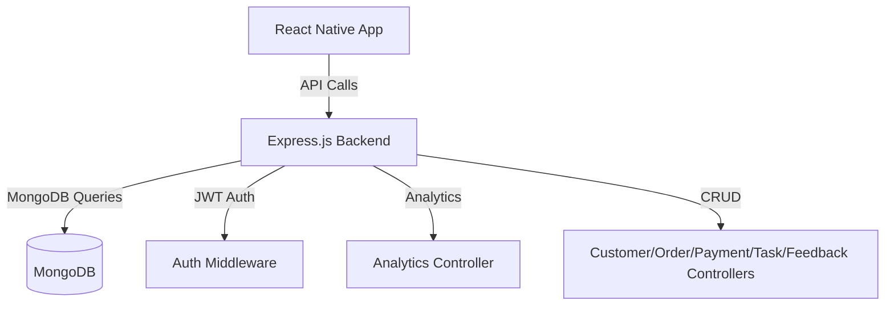

# TailorTMS


## Overview

TailorTMS is a comprehensive, full-stack Tailoring Management System designed to streamline the operations of tailoring businesses. It provides robust modules for managing customers, orders, payments, tasks, feedback, and analytics, with a modern, mobile-friendly frontend and a secure, scalable backend. The system is built with a focus on reliability, extensibility, and ease of use for both end-users and developers.

---

## Architecture Diagram



---

## Features

- **Customer Management:** Add, edit, view, and delete customer profiles and measurements.
- **Order Management:** Track orders, statuses, and associated customers.
- **Payment Management:** Record and manage payments, methods, and statuses.
- **Task Management:** Assign and monitor tailoring tasks for staff.
- **Feedback Module:** Collect and review customer feedback with ratings and comments.
- **Analytics Dashboard:** Visualize key business metrics, tailor performance, and trends.
- **Authentication:** Secure JWT-based login and protected routes.
- **Validation & Error Handling:** Robust validation using `express-validator` and consistent API responses.
- **Notifications:** User-friendly toast notifications for all CRUD operations.
- **Modern UI:** Clean, teal/blue-green themed React Native interface.
- **Production-Ready:** Vercel deployment, environment variable support, and comprehensive documentation.

---

## Technology Stack

- **Frontend:** React Native (TypeScript), modern component-based architecture
- **Backend:** Node.js, Express.js, MongoDB (Mongoose)
- **Authentication:** JWT (JSON Web Token)
- **Testing:** Jest, Supertest
- **Deployment:** Vercel (serverless backend), GitHub

---

## Getting Started

### Prerequisites
- Node.js (v18+ recommended)
- npm or yarn
- MongoDB instance (local or cloud, e.g., MongoDB Atlas)
- Android/iOS emulator or device for React Native

### Installation

1. **Clone the repository:**
   ```sh
   git clone https://github.com/yourusername/TailorTMS.git
   cd TailorTMS
   ```

2. **Install backend dependencies:**
   ```sh
   cd BACKEND
   npm install
   ```

3. **Install frontend dependencies:**
   ```sh
   cd ../FRONTEND
   npm install
   ```

4. **Set up environment variables:**
   - Create a `.env` file in `BACKEND` with:
     ```env
     MONGODB_URI=your_mongodb_connection_string
     JWT_SECRET=your_jwt_secret
     PORT=5000
     ```
   - For Vercel, add these in the dashboard under Project Settings > Environment Variables.

---

## Running the Application

### Backend (API Server)
From the `BACKEND` directory:
```sh
npm start
# or
node index.js
```
The server will run at `http://localhost:5000` by default.

### Frontend (React Native App)
From the `FRONTEND` directory:
```sh
npx react-native run-android   # For Android
npx react-native run-ios       # For iOS (Mac only)
npx react-native start         # Metro bundler only
```

---

## API Documentation

All API endpoints return JSON with the structure:
```json
{ "success": true|false, "data": ..., "error": ... }
```

### Main Endpoints
- **Customers:**
  - `GET /api/customers` — List all customers
  - `POST /api/customers` — Add a customer
  - `PUT /api/customers/:id` — Update customer
  - `DELETE /api/customers/:id` — Delete customer
- **Orders:**
  - `GET /api/orders` — List all orders
  - `POST /api/orders` — Add an order
  - `PUT /api/orders/:id` — Update order
  - `DELETE /api/orders/:id` — Delete order
- **Payments:**
  - `GET /api/payments` — List all payments
  - `POST /api/payments` — Add a payment
  - `PUT /api/payments/:id` — Update payment
  - `DELETE /api/payments/:id` — Delete payment
- **Tasks:**
  - `GET /api/tasks` — List all tasks
  - `POST /api/tasks` — Add a task
  - `PUT /api/tasks/:id` — Update task
  - `DELETE /api/tasks/:id` — Delete task
- **Feedback:**
  - `GET /api/feedback` — List all feedback
  - `POST /api/feedback` — Add feedback (JWT required)
  - `PUT /api/feedback/:id` — Update feedback (JWT required)
  - `DELETE /api/feedback/:id` — Delete feedback (JWT required)
- **Analytics:**
  - `GET /api/analytics` — Get business analytics and trends

---

## Deployment

### Deploying to Vercel
1. Push your code to GitHub.
2. Go to [vercel.com](https://vercel.com/) and import your repository.
3. Set the root directory and configure the `vercel.json` as needed.
4. Add environment variables in the Vercel dashboard.
5. Click "Deploy" and wait for the build to finish.
6. Update your frontend `API_BASE_URL` to the deployed backend URL.

### Production Checklist
- [x] All modules tested (CRUD, validation, error handling)
- [x] Environment variables set
- [x] JWT authentication enabled
- [x] API base URL updated in frontend
- [x] Documentation and README updated

---

## Contribution Guidelines

1. Fork the repository and create a new branch for your feature or bugfix.
2. Write clear, concise commit messages.
3. Ensure all tests pass before submitting a pull request.
4. Follow the existing code style and structure.
5. Submit a pull request with a detailed description of your changes.

---

## License

This project is licensed under the MIT License. See the [LICENSE](LICENSE) file for details.

---

## Contact & Support

For questions, feature requests, or support, please open an issue on GitHub or contact the maintainer at [your-email@example.com].

---

## Acknowledgements
- React Native, Node.js, Express, MongoDB, Jest, Vercel, and the open-source community.
- Special thanks to contributors and testers who helped make TailorTMS robust and production-ready.

---

## Advanced Usage Examples

### 1. Customizing API Base URL
To point your frontend to a different backend (e.g., production):
```js
// FRONTEND/config.js
export const API_BASE_URL = 'https://your-vercel-app.vercel.app/api';
```

### 2. Using JWT Authentication in API Requests
```js
fetch(`${API_BASE_URL}/feedback`, {
  method: 'POST',
  headers: {
    'Content-Type': 'application/json',
    'Authorization': `Bearer ${your_jwt_token}`
  },
  body: JSON.stringify({ orderId, tailorName, rating, comment })
});
```

### 3. Running All Tests
```sh
cd BACKEND
npm test
```

### 4. Adding a New Module
- Create a new model in `BACKEND/models/`.
- Add a controller in `BACKEND/controllers/`.
- Add routes in `BACKEND/routes/`.
- Register the routes in your main app file.
- Add frontend forms/pages as needed.

### 5. Deploying with Custom Domains
- In Vercel, add your custom domain in the dashboard.
- Update your frontend `API_BASE_URL` to use the new domain.
